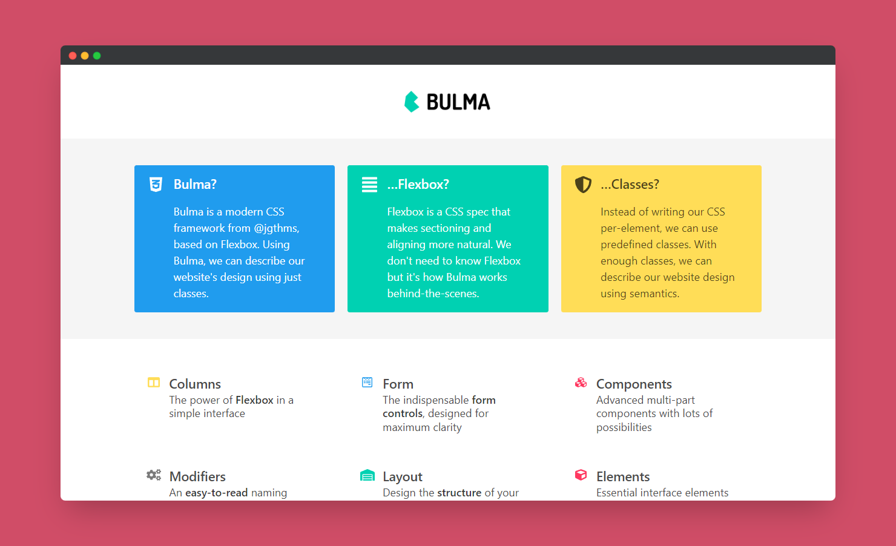

# Scrimba - Bulma Introduction solution

This is a solution to the [Bulma Introduction project on Scrimba](https://scrimba.com/learn/). Scrimba helps you improve your coding skills by building realistic projects.

## Table of contents

- [Overview](#overview)
  - [The challenge](#the-challenge)
  - [Screenshot](#screenshot)
  - [Links](#links)
- [My process](#my-process)
  - [Built with](#built-with)
  - [Useful resources](#useful-resources)
- [Author](#author)
- [Acknowledgments](#acknowledgments)

## Overview

### The challenge

Users should be able to:

- See a responsive landing page

### Screenshot

### Links

- Solution URL: [@GitHub](https://github.com/xdelmo/bulma-introduction)

## My process

### Built with

- Semantic HTML5 markup
- CSS framework Bulma
- CSS custom properties
- Flexbox
- Mobile-first workflow

### Useful resources

- [Bulma](https://bulma.io/) - Open source CSS framework that provides ready-to-use frontend components

## Author

- Website - [Emanuele Del Monte](https://www.emanueledelmonte.it)

## Acknowledgments

A big thank you to [Zaydek Gualtieri](https://twitter.com/username_zaydek)
